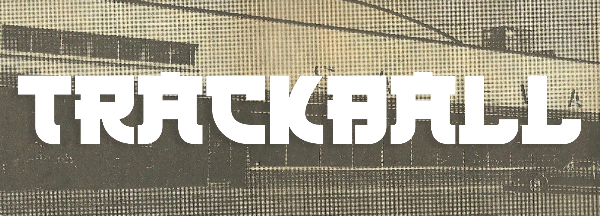
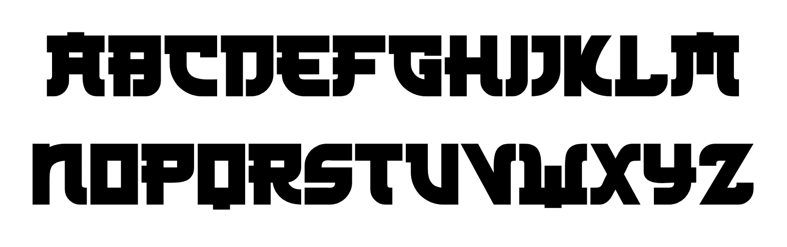
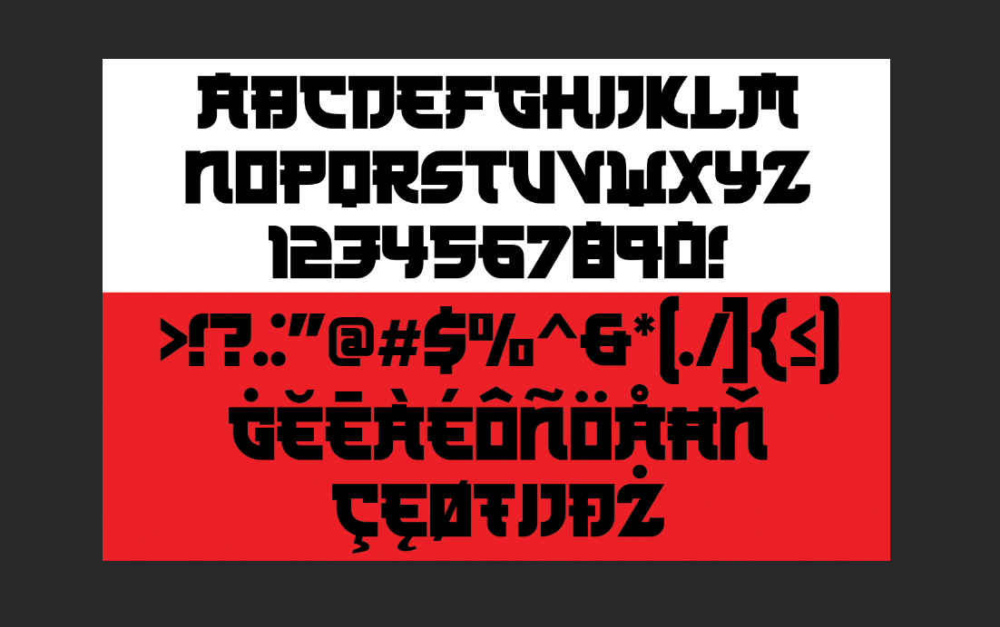
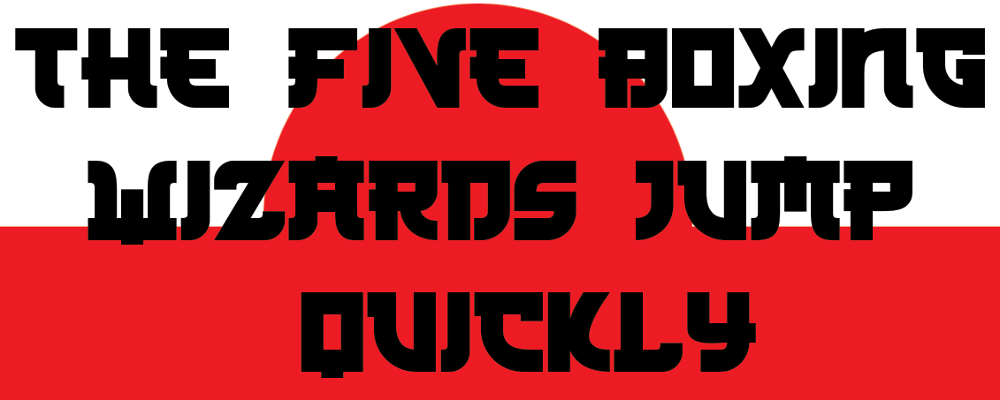

# Trackball

A trackball is a pointing device consisting of a ball held by a socket containing sensors to detect a rotation of the ball about two axes—like an upside-down ball mouse with an exposed protruding ball.

## Variable Font Axe

Trackball has the following axe:

  Tag | Default | Static Instances
--- | --- | ---
  wght | 400 | Regular

## Image License
The images in this repository are licensed under the CC https://creativecommons.org/licenses/by-sa/4.0/

## License
This Font Software is licensed under the SIL Open Font License, Version 1.1.
This license is available with a FAQ at [https://openfontlicense.org](https://openfontlicense.org)

